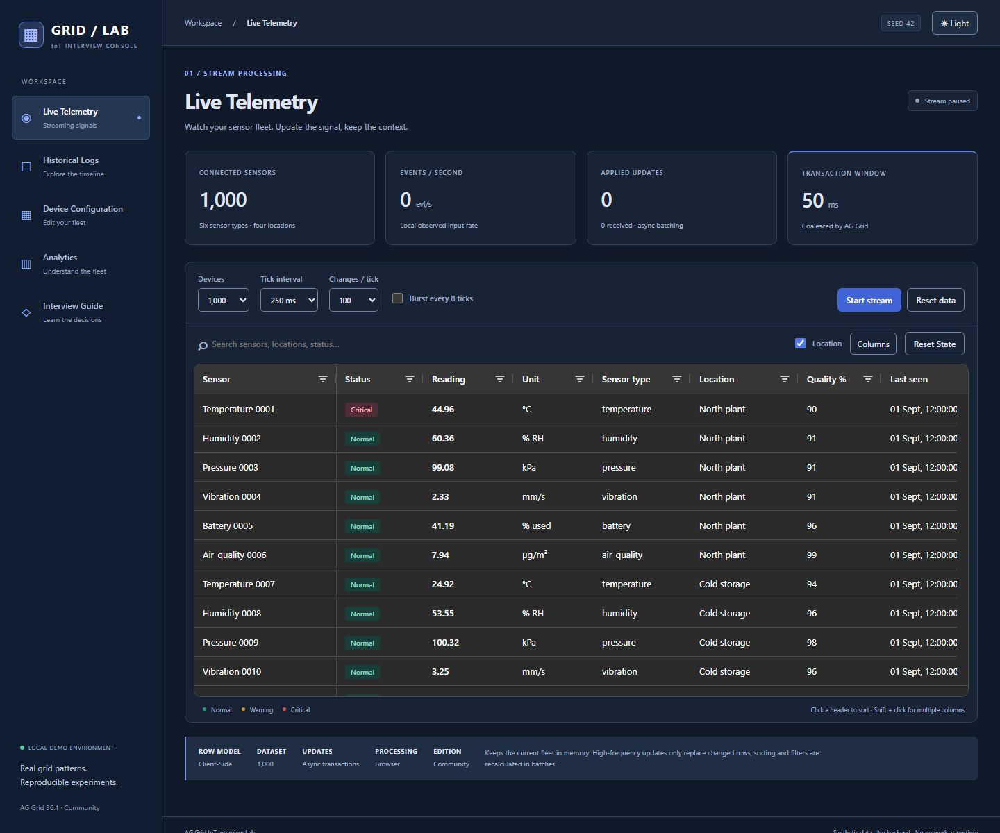
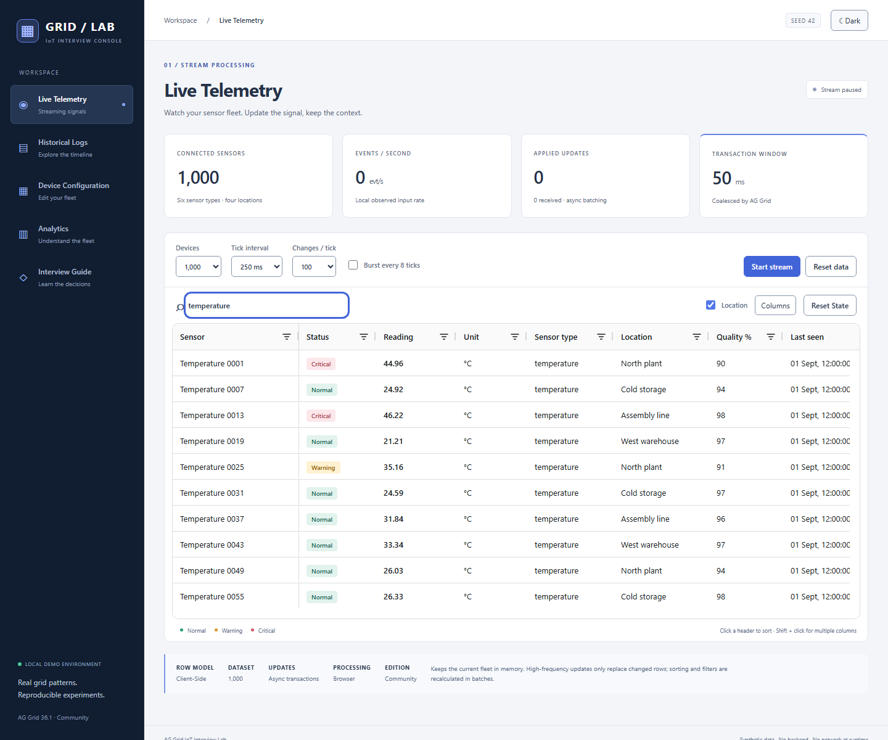
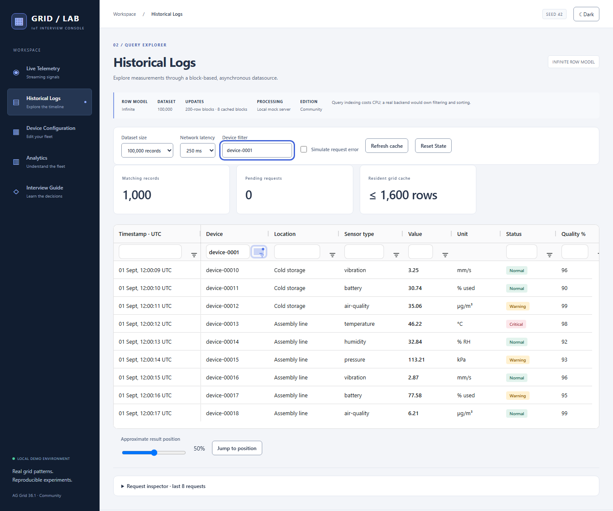
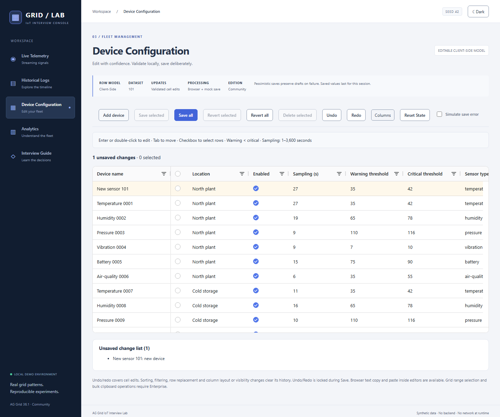
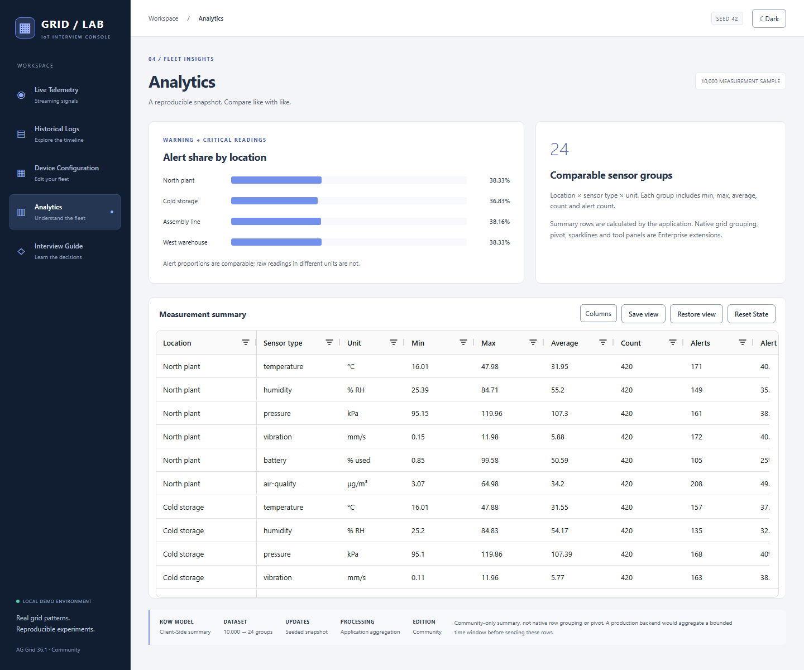
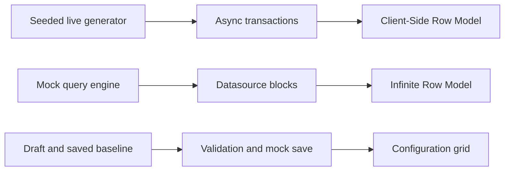

<div align="center">
  <h1>AG Grid IoT Interview Lab</h1>
  <p>A hands-on React and TypeScript playground for streaming telemetry,<br />large historical datasets and spreadsheet-style editing.</p>

<a href="https://github.com/serhii-baksheiev/ag-grid-interview-lab/actions/workflows/ci.yml"></a>


<a href="LICENSE"></a>
</div>



**Synthetic data. Four focused scenarios. Native grid APIs you can explain.**

[Scenarios](#four-scenarios) · [Architecture](#architecture) · [Run locally](#getting-started) · [Verification](#verification) · [Practice](#interview-practice)

## Why this project

Practice the decisions behind a data-heavy interface: how to update rows without losing identity, when to fetch blocks instead of loading everything, and how to keep edits safe when a save fails. Each screen exposes those decisions through a small, inspectable feature module.

The demo runs without an account or backend. Seed **42** makes device data reproducible; historical timestamps use a fixed UTC epoch. Live timestamps follow the demonstration clock.

## Visual overview

<table>
  <tr>
    <td><a href="docs/screenshots/live-telemetry.png"></a><br /><b>Live Telemetry</b> · stable IDs and async updates</td>
    <td><a href="docs/screenshots/historical-logs.png"></a><br /><b>Historical Logs</b> · query before pagination</td>
  </tr>
  <tr>
    <td><a href="docs/screenshots/device-configuration.png"></a><br /><b>Device Configuration</b> · validate, save, revert</td>
    <td><a href="docs/screenshots/analytics.png"></a><br /><b>Analytics</b> · summaries without mixing units</td>
  </tr>
</table>

Screenshots come from the production preview at a consistent viewport. Click an image to inspect it.

## Four scenarios

| Scenario                 | What to try                                                                          | Why this row model                                                                                                 |
| ------------------------ | ------------------------------------------------------------------------------------ | ------------------------------------------------------------------------------------------------------------------ |
| **Live Telemetry**       | Stream up to 10,000 sensors; sort, search, pause and reset                           | Client-Side keeps the current fleet in memory. Stable IDs and async transactions update changed rows.              |
| **Historical Logs**      | Explore a virtual 500,000-record dataset; sort, filter, simulate a failure and retry | Infinite requests 200-row blocks. The mock query engine filters and sorts before slicing; eight blocks are cached. |
| **Device Configuration** | Edit thresholds, save selected devices, simulate failure and revert                  | Client-Side suits a small editable fleet. Drafts and saved baseline are separate; saves are pessimistic.           |
| **Analytics**            | Compare 24 location/type/unit groups and save a column view                          | Client-Side displays a flat summary computed from a deterministic 10,000-reading sample.                           |

Use Tab and arrow keys to navigate, Enter/F2 to edit, and Escape to cancel. Text status badges, named grids, light/dark themes and an inline deletion confirmation support keyboard-oriented demonstrations.

## Architecture



Feature folders own their columns, models and screen components. Shared code handles deterministic data, formatting, themes and validated view storage. There is no global state manager or universal grid wrapper.

Historical requests finish exactly once, including cancellation. Query changes abort stale work; changing only simulated latency preserves the query index. Grid State is restored section by section, retaining valid column settings when a filter is malformed. Configuration remains mounted after its first visit so navigation preserves drafts.

See [architecture](docs/ARCHITECTURE.md) and the [regression tests](e2e/remediation.spec.ts).

## Performance decisions

- **Streaming:** `applyTransactionAsync` batches updates in a 50 ms window. The [Live test](src/features/live-telemetry/LiveTelemetry.test.tsx) checks stable identity and transaction updates.
- **History:** a compact typed index is shared across blocks. An 8 ms work budget with MessageChannel yielding avoids excessive timer clamping while allowing cancellation.
- **Measured locally:** isolated 500k Value-sort median fell from **4,599 ms to 680 ms**, with **711 → 82 yields** across three before/after runs. This excludes grid rendering and network delay; it is not a universal benchmark.
- **Reset:** seeded rows are reused for a same-size reset; changed rows are restored in bounded transactions.

[Measurement method, CPU/heap observations and limitations →](docs/PERFORMANCE.md)

## Community vs Enterprise

The application uses **AG Grid Community 36.1.0** and `ag-grid-react` at the same version. No Enterprise package or licence key is installed.

Community supplies the row models used here, sorting, text/number filters, editing, row selection, Grid State and cell-edit undo/redo. Native grouping, pivot, Server-Side Row Model, range selection and bulk grid clipboard are **not implemented**. Analytics uses ordinary application aggregation and an HTML/CSS chart.

[Feature and edition matrix →](docs/FEATURE_MATRIX.md)

## Getting started

Requires **Node.js 22.12+** and npm. CI uses Node 22.

```sh
git clone https://github.com/serhii-baksheiev/ag-grid-interview-lab.git
cd ag-grid-interview-lab
npm ci
npm run dev
```

Open the URL Vite prints. To run production assets:

```sh
npm run build
npm run preview
```

There is no environment file, backend setup or runtime account requirement.

## Verification

```sh
npm run format:check
npm run lint
npm run typecheck
npm test
npm run build
npx playwright install --with-deps chromium
npm run test:e2e
npm audit --omit=dev
```

Vitest covers domain rules, query correctness, datasource lifecycle, malformed storage and component interactions. Playwright runs Chromium against a dedicated production preview on port **4176**; it refuses to reuse an unrelated server. Tests cover retry, typing races, theme persistence, keyboard editing, narrow viewports and axe accessibility checks.

The [CI workflow](.github/workflows/ci.yml) runs quality and E2E jobs for PRs and pushes to `main`. Separate `test:unit` and `test:integration` scripts are available for focused work.

## Interview practice

1. **Follow a live update:** show stable `getRowId`, change a measurement, and explain why a transaction preserves grid context.
2. **Trace a historical request:** filter 500k records, inspect blocks, trigger a failure and retry. Explain cancellation and filtering before pagination.
3. **Make an edit safe:** change a threshold, simulate a save failure, navigate away and back, then revert. Explain draft versus baseline.

The in-app Interview Guide links concepts to code. [Ten live-coding exercises](docs/LIVE_CODING_TASKS.md) include setup, acceptance checks and trade-offs.

## Documentation

- [Architecture](docs/ARCHITECTURE.md) · [Performance](docs/PERFORMANCE.md) · [Feature matrix](docs/FEATURE_MATRIX.md)
- [Interview notes — Russian](docs/INTERVIEW_NOTES_RU.md) · [Spoken explanations — English](docs/INTERVIEW_PHRASES_EN.md)
- [Live-coding exercises](docs/LIVE_CODING_TASKS.md) · [Audit remediation](docs/audits/REMEDIATION.md)

## Limitations

Historical data and network failures are synthetic. Query work still runs in the browser; 500k describes a virtual historical dataset, not 500k rendered rows. Configuration saves persist **in memory for the current session**. Only view settings are stored in localStorage.

Undo/redo covers cell edits, not the application's full history. Sorting, filtering, row replacement and column layout/visibility changes can clear the native undo stack. Save locks editing and undo shortcuts until completion.

This is an interview lab, not a production monitoring service or a WCAG certification. Local performance results depend on hardware, browser, load and query shape.

## License

[MIT](LICENSE) · Copyright © 2026 Serhii Baksheiev. Dependencies retain their respective licences.
