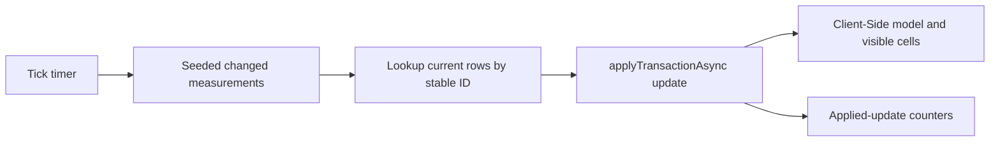
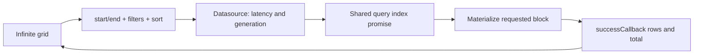
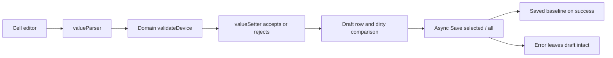

# Architecture

## Feature boundaries

The shell owns navigation and theme. Each feature owns its column definitions, interaction state and AG Grid integration. Shared code has narrow responsibilities: domain types, seeded generation, formatters, module registration, visual primitives and validated view-state storage. There is no abstraction intended to hide Grid API or unify all row models.

The four datasets are intentionally independent. Configuration edits demonstrate an editing workflow; they are not wired into the live stream. Historical and analytics values come from the same deterministic generator but represent separate query/sample surfaces.

## Domain and reproducibility

Devices have identity, descriptive metadata, status, enabled flag, unit, sampling interval, two thresholds and last-seen time. Telemetry adds its own identity, device reference, timestamp, value, quality and optional diagnostics. Six sensor types span four locations.

`randomAt(index, seed)` is an addressable integer hash. `telemetryAt(index)` can create any measurement without generating preceding records; seed 42 and a fixed UTC epoch make historical expectations reproducible. Live values also derive from seed/tick/index, while their last-seen timestamp uses wall time. Battery measures percentage used: high values mean greater depletion.

## Live updates

The complete current fleet is available in memory, so the Client-Side Row Model can sort, filter and update it directly. The initial `rowData` array is replaced only when resetting/regenerating the fleet. Each tick builds replacement objects for changed devices and submits one transaction. AG Grid batches transactions with a 50 ms window. Row identity comes from `getRowId`, never the current displayed index.

Metrics use refs for stream counters and update React separately from every individual event. Timer cleanup stops input and flushes pending grid work when appropriate. Column definitions and shared grid props keep stable references. Rendering uses ordinary formatting where possible and a small status renderer where visual semantics justify it.

## Historical queries

The Infinite Row Model supplies a Community-compatible block-loading interface for a flat history. It requests half-open ranges `[startRow, endRow)` through `getRows`. The datasource returns the filtered record count to stop further scrolling and uses `failCallback` for active request failures.

The default unfiltered, unsorted query addresses a block directly. Filtering or sorting requires a scan across the virtual dataset. Matching source indices are retained in a `Uint32Array`; temporary scalar sort keys avoid repeatedly generating full records inside a comparator. A stable merge sort yields during work. Only the requested block becomes retained telemetry objects in the grid.

The datasource caches a promise for the current query index so valid concurrent blocks share processing. Query signature changes abort obsolete index work; request sequence numbers are diagnostic identities, not a latest-request-wins rule. Different blocks for the same query remain valid concurrently. Destroying the datasource cancels pending timers and processing. The inspector retains eight entries, not an unbounded request history.

AG Grid caches eight blocks of 200 rows. Text and number filters are processed by the mock before pagination, including supported AND/OR conditions. Column controls debounce filter changes. Quick Filter is used only on the client-side live grid. Historical position jumping targets the current result ordering, not a raw timestamp lookup.

Cooperative yielding does not make this a server: index construction still consumes main-thread CPU and O(N) scalar/index memory. It is a teaching compromise that avoids a backend and makes the request contract visible. No full 500,000-record object array is recreated on React renders.

## Configuration editing and save

The editing pipeline separates display and persistence:

A custom React name editor (`NameEditor.tsx`) demonstrates `CustomCellEditorProps`, `onValueChange`, `parseValue` and `useGridCellEditor` validation. It preserves raw typing while passing a parsed draft to the grid. Number, select and checkbox fields use provided Community editors. Numeric parsing is separate from locale-aware display formatting. The setter validates a candidate device before mutation, returning false for invalid data. Errors appear both in a message and cell styling. Save validates again: a UI editor is not a sufficient domain boundary.

The invariant is `warningThreshold < criticalThreshold`; sampling is an integer from 1 to 3,600 seconds. A stable grid row array supports native edit undo/redo while React refreshes dirty metadata. The saved baseline is copied independently. Save is pessimistic: editing/actions are restricted while the simulated request is in flight, and the baseline advances only on success. Failed saves retain drafts.

Adding a row marks it dirty. Deletion requires confirmation and is staged; Save all commits staged deletions and Revert all restores them before saving. Native undo/redo handles cell edits, not the complete application transaction history. Sorting, filtering and row replacement clear native undo stacks.

The shell keeps Configuration mounted once visited, preserving in-memory drafts when navigating. Reload starts a fresh mock session. In production, saved configuration would come from an API and draft durability would be an explicit product decision.

## Analytics

A deterministic 10,000-record sample is aggregated by location, sensor type and unit. Summary records contain count, min, max, average and warning/critical share. Mixing temperature, pressure and percentage values in one average would be meaningless, so units remain separate. The result is a flat Community grid plus a small separate HTML/CSS bar chart.

This is application-level aggregation, not AG Grid's native grouping or `aggFunc` pipeline. Native grouping, pivot, tool panels and integrated charting are documented Enterprise extension points.

## View state

`useGridState` connects `initialState`, `onStateUpdated` and `onGridPreDestroyed` to storage. Per-grid keys are versioned (`iot-lab:v1:*`). Persisted sections are column order, sizing, pinning, visibility, sorting and filters; unnecessary state and row data are excluded. Shape validation and size/depth bounds protect the Grid API from malformed localStorage. Storage exceptions fall back to usable in-memory interaction.

`initialState` is read on grid construction, not on every render. Partial column-state restoration sets `partialColumnState`. Analytics also provides explicit saved-view restoration. Reset State clears column/filter changes. Theme has its own independent key.

## A real Node.js / Timestream boundary

The browser would send a validated query DTO: time range, device/location/type predicates, numeric limits, supported sort order, block/page size and continuation information. Node.js would whitelist query fields/operators, apply access rules and translate the DTO into parameterized queries or safely validated query construction. It would map Timestream results into telemetry DTOs and normalize time/unit semantics.

Large queries would use time windows and continuation tokens rather than assume arbitrary offsets are cheap. An exact filtered count may require separate expensive work; the grid can initially operate without it. Cancellation would abort fetches and, where supported, backend work. Client generations would still protect against late responses.

Live events would come from a subscription such as WebSocket/SSE; reconnect, deduplication, ordering, backpressure and retention policies would become explicit. Configuration saves would need version/conflict checks and server validation. SSRM would be appropriate when server-backed grouping, aggregation or pivot is required, and would introduce an Enterprise dependency.

## References

- [Row models](https://www.ag-grid.com/react-data-grid/row-models/)
- [Infinite datasource contract](https://www.ag-grid.com/react-data-grid/infinite-scrolling/)
- [High-frequency transactions](https://www.ag-grid.com/react-data-grid/data-update-high-frequency/)
- [Saving edited values](https://www.ag-grid.com/react-data-grid/value-setters/)
- [Grid State](https://www.ag-grid.com/react-data-grid/grid-state/)
